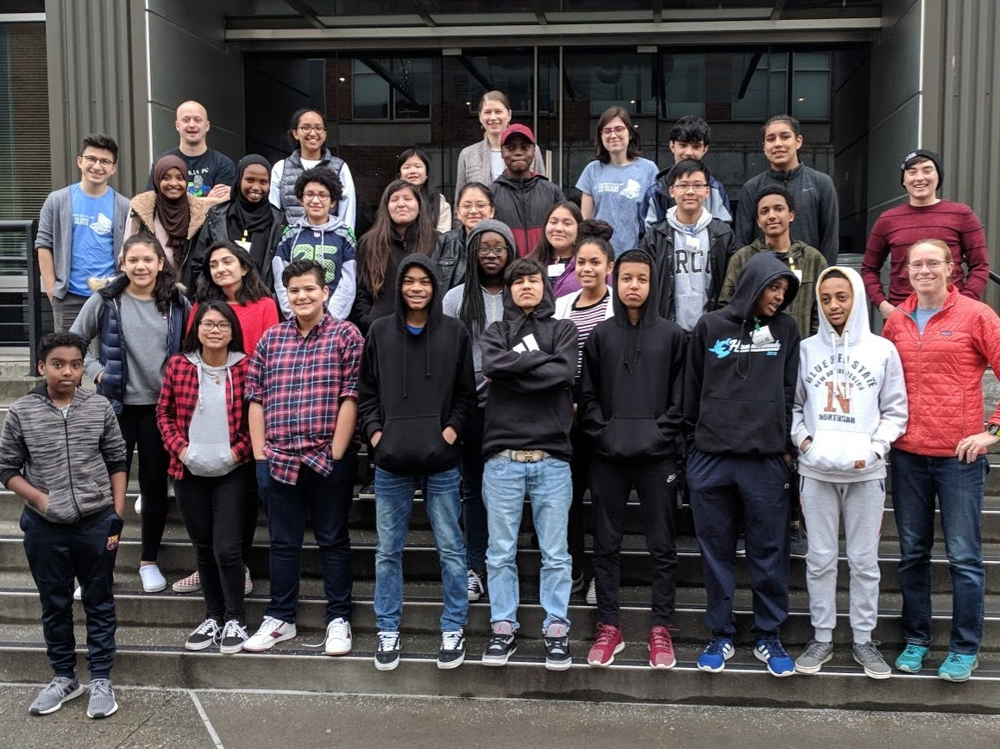

# Rainier Scholars CS Class

* [Home](https://sites.google.com/corp/view/rainier-scholars-cs-class/home?authuser=0)
* [Class roles and responsibilities](https://sites.google.com/corp/view/rainier-scholars-cs-class/class-roles-and-responsibilities?authuser=0)

Welcome!

This website has information for instructors, TAs and students in the Rainier Scholars CS Class, hosted by Google.

## About Rainier Scholars

The amazing [Rainier Scholars program](https://www.rainierscholars.org/) aims to get low-income, minority students into college... and prepare them for success after college.

## About the class

In this year's class we're introducing thirty-five 8th grade scholars to computer science with the aim to eventually improve [diversity in the field](https://diversity.google/).

The class is held from 10-12 a.m. on Saturdays, virtually on Google Meet.

Spring 2021 Dates: March 6 - May 1

## Sign up to help

We need all kinds of help!

*   Lecturing / presenting
*   Helping students with questions
*   Showing students where to go
*   Curriculum development

How to get started:

*   Learn more about various volunteer [roles](roles).
*   [Sign up](https://docs.google.com/spreadsheets/d/1Q4Y1j8UpYjDROK0JZlf7Fntopk3NcYAwhqGGzLjPPtg/edit#gid=0) for specific roles and dates.
*   Join our [rainier-scholars-cs-tas](https://groups.google.com/forum/#!forum/rainier-scholars-cs-tas/join) Google Group (mailing list).

Looking for the class attendance sheet?

*   Take attendance in [this spreadsheet](https://docs.google.com/spreadsheets/d/1k32idh_KGpRYJuVuAo1wbhRtmzBL35mH-B_l3DS3Ngo/edit?usp=sharing_eip&ts=5e35b942&urp=gmail_link)

## Learn about the curriculum

We follow the [Bootstrap world](https://bootstrapworld.org/materials/fall2018/courses/algebra/en-us/) algebra curriculum and use the [PyRet](https://www.pyret.org/) language.

[Online PyRet IDE](https://code.pyret.org/).

We created some of our own class materials.

2020 materials are [here](https://drive.google.com/drive/folders/1vsnMW-fARDHgloon0FW5FVldyrwwist9)

2018 materials are [here](https://drive.google.com/drive/folders/1GAMjvHFFOG0-urWFCYsWnoghTrC0FfaV).

2017 materials are [here](https://drive.google.com/corp/drive/folders/0B8EPFRL2mUyVd3VaTXVZZ3h1YWM).

Questions or feedback? [Contact us](mailto:susan.ashlock@gmail.com).
